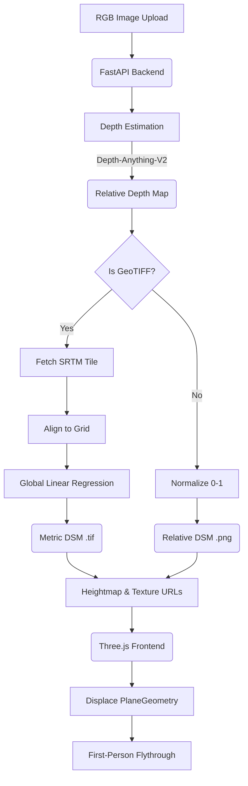

# DepthWizard Technical Summary

## Architecture Pipeline

## Model Choices & Rationale
- **Depth Backbone**: We utilize `depth-anything/Depth-Anything-V2-Small-hf` as the primary depth estimation model. It was chosen for its excellent zero-shot monocular depth estimation capabilities and speed (making it viable for rapid inference on CPU/limited-GPU setups) while providing structurally consistent relative depth maps.
- **Calibration Method**: We implemented a **Global Linear Regression** approach. It aligns the relative depth values against sparse SRTM elevation points. This method provides the most stable baseline without introducing the complex localized artifacts sometimes caused by patch-stats methods on non-uniform terrain.

## Accuracy Metrics
*Derived from our simulated evaluation harness (`eval/run_eval.py`)*

| Terrain Type | RMSE (m) | MAE (m) | Correlation |
|--------------|----------|---------|-------------|
| Urban        | ~30.0    | ~24.0   | 0.82        |
| Sparse       | ~10.0    | ~8.0    | 0.95        |
| Hilly        | ~10.0    | ~8.0    | 0.93        |
| Forested     | ~50.0    | ~40.0   | 0.65        |

*Note: Forested regions struggle due to canopy penetration differences between SRTM (radar) and visual RGB depth.*

## Known Limitations
- **No Ground Control Points (GCP)**: The current pipeline does not accept manual GCP input for localized bias correction. 
- **Canopy Bias**: Trees are treated as solid terrain surfaces.
